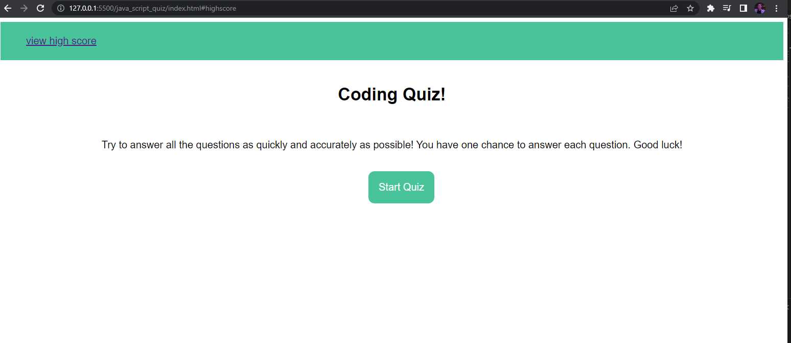

# java_script_quiz

site link:
repo link: https://github.com/sdoval27/java_script_quiz

## Description

- This site is a timed JavaSript quiz.

### Usage:
- To start the quiz, press the start button. This will start the countdown timer and (if I'm able to finish in time) display the quiz questions.
- If the timer runs out, the user will be directed to the results page where they can write their initials and score to be saved (in theory) to the leaderboard section of the quiz.
- Because I'm having trouble getting the questions to loop, the user has to wait for the timer to run out before the quiz ends :')
- Will develop further in the future.

## Installation

N/A

## Usage
When opening the page, the website should appear as so:

 
## License
 
[MIT](https://choosealicense.com/licenses/mit/)

[def]: title-element.png
